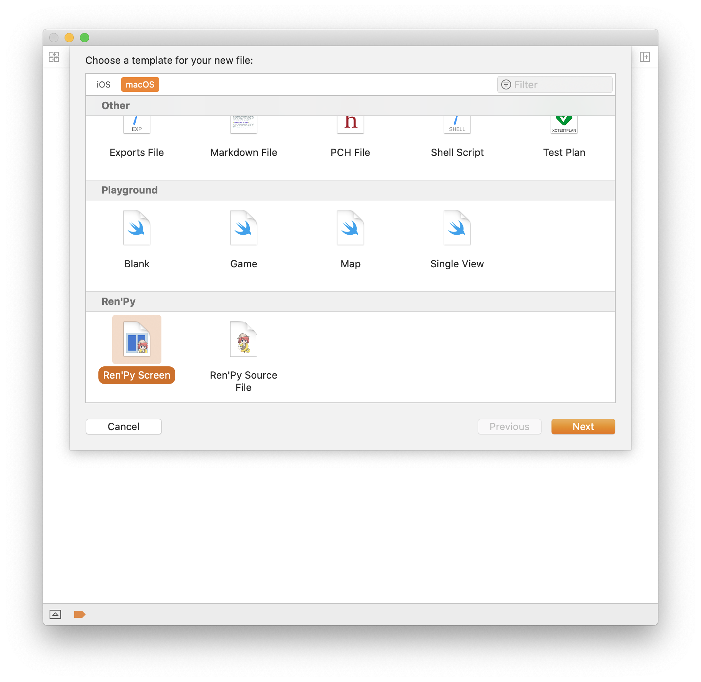
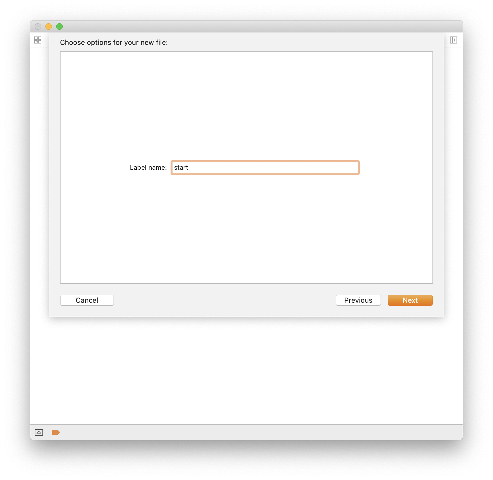
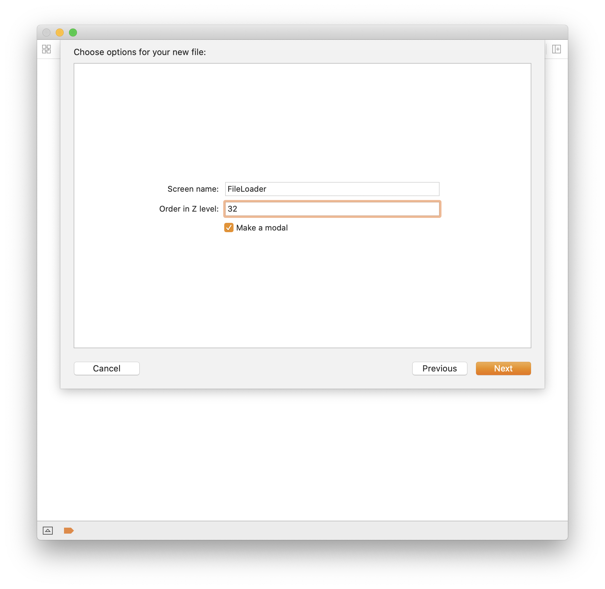

# Ren'Py Templates for Xcode

File templates for a Ren'Py labels and screens

## About

This repository contains Xcode templates for Ren'Py script files and Ren'Py screen files. This project is intended to help extend Xcode's functionality and make it Ren'Py-ready. More information on this project can be found here: https://marquiskurt.net/2019/06/09/post.html

## Installation instructions

### Automatic

Run the `install.sh` file in the root of the repository directory to make the folders and copy the files over as necessary.

### Manual

To install these templates, copy them to your Xcode directory as follows:

```
cp -rf *.xctemplate ~/Library/Developer/Xcode/Templates/File Template/Custom Templates/Ren\'Py/
```

If the path doesn't exist, make sure you create the folders first.

## Screenshots


**Ren'Py Category in New File wizard**


**Ren'Py script options**


**Ren'Py screen options**

## License
This repo is licensed under Apache 2.0.
